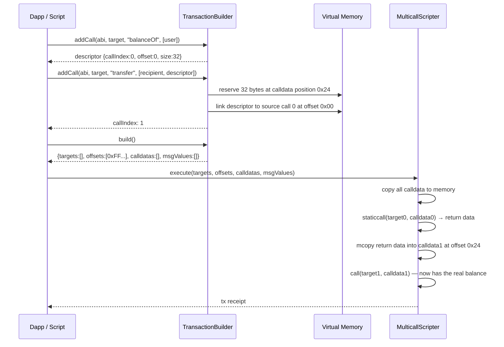

<!-- agentify: generated 2026-05-31 | score-before: 0 | source: 1.3.0 -->
# Multicall Scripting — Architecture Overview

Execute complex multi-contract strategies in a single atomic transaction with
full return value chaining between calls. Regular multicall solutions (like
Multicall3) only batch independent calls — they cannot use one call's return
value as an argument to the next. Multicall Scripting solves this with
precalculated memory offsets and the `mcopy` opcode, enabling strategies like
"read a user's balance from Aave, then borrow DAI against it" in one atomic step.

The system has two layers that must stay in sync:
1. **Solidity** (`src/`) — on-chain execution engine that decodes offset metadata
   and copies return data between calls using Yul assembly
2. **JavaScript** (`js/`) — offchain transaction builder that simulates the EVM
   memory layout, tracks data dependencies between calls, and encodes compact
   256-bit offset words

---

## Architecture Diagram

```mermaid
graph TD
    User[User / Dapp] -->|builds transaction| JS[JS TransactionBuilder]
    JS -->|addCall chain| DESC[Descriptor Proxies]
    DESC -->|tracks deps| MEM[Virtual Memory Layout]
    MEM -->|encode offsets| BUILD[build()]
    BUILD -->|targets, offsets, calldatas, msgValues| TX[Transaction]
    TX -->|submits to| MC[MulticallScripter.execute]
    MC -->|dispatches by calltype| DISP[Assembly Dispatch]
    DISP -->|0xFF| SC[staticcall]
    DISP -->|0xFE| CC[call]
    DISP -->|0xFC/0xFB| PR[Partial Return]
    SC -->|mcopy return data| CD[In-Memory Calldata]
    CD -->|next call finds| CC2[Subsequent Call]
    PR -->|mcopy per variable| CD
```

## Components

| Component | Responsibility | Key Files |
|-----------|---------------|-----------|
| MulticallScripter | On-chain execution: copies calldata to memory, executes calls in order, uses mcopy to wire return values | `src/MulticallScripter.sol` |
| CallBuilder | Solidity DSL for building call chains in tests; encodes offset words with bit-packing | `src/CallBuilder.sol` |
| 7702Caller | EIP-7702 account abstraction compatibility wrapper | `src/7702Caller.sol` |
| TransactionBuilder | JavaScript class for building call batches; tracks memory layout, creates descriptor proxies | `js/index.js` |
| CLI | Command-line interface for transaction building via JSON input | `js/cli.js` |
| Helpers (test) | Mock contracts for testing: SimpleReturn, DynamicReturn, Structs, Fuzzy, etc. | `test/Helpers.sol` |
| JS Examples | Runnable strategy scripts: Uniswap reserves, Aave deposits, multi-swaps | `js/examples/` |

## Data Flow



## External Dependencies

| Dependency | Purpose | Version |
|-----------|---------|---------|
| Foundry | Solidity development framework (forge, cast, anvil) | latest stable |
| Bun | JavaScript runtime for tests, examples, CLI | latest stable |
| viem | ABI encoding (`encodeFunctionData`, `getAbiItem`) | ^2.32.1 |
| forge-std | Foundry standard test library | (submodule) |
| solady | Gas-optimized Solidity utilities | (submodule) |
| weiroll-huff | Weiroll implementation (gas comparison baseline) | (submodule) |

## Read More

- Solidity contracts deep dive → [docs/contracts.md](contracts.md)
- JavaScript library deep dive → [docs/javascript.md](javascript.md)
- Test patterns and suites → [docs/testing.md](testing.md)
- Example strategy scripts → [docs/examples.md](examples.md)
- Solidity conventions → [.claude/rules/solidity.md](../.claude/rules/solidity.md)
- JavaScript conventions → [.claude/rules/javascript.md](../.claude/rules/javascript.md)
- Testing conventions → [.claude/rules/testing.md](../.claude/rules/testing.md)
