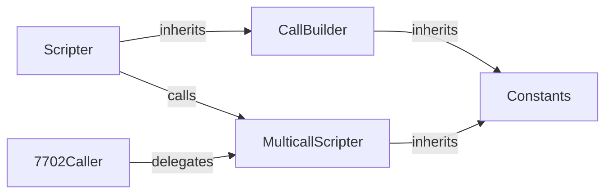

<!-- agentify: generated 2026-05-31 | score-before: 0 | source: 1.3.0 -->
# Solidity Contracts

The on-chain execution layer. Three contracts handle call dispatch, offset
decoding, and account abstraction. The core contract (`MulticallScripter`) is
written entirely in Yul assembly for gas efficiency and precise memory control.
A companion DSL (`CallBuilder`) provides a Solidity-native way to build test
call chains, and `7702Caller` adds EIP-7702 compatibility.

## Key Files

| File | Lines | Purpose |
|------|-------|---------|
| `src/MulticallScripter.sol` | 236 | Core executor: `execute()` runs chained calls with mcopy-based return data wiring |
| `src/CallBuilder.sol` | 294 | Offset encoding helpers + `Scripter` DSL for building call chains in tests |
| `src/7702Caller.sol` | — | EIP-7702 account abstraction wrapper |

## Internal Architecture



## Important Patterns

### Offset encoding is hand-rolled bit packing
There are 5 call type flags, each with a unique bit layout packed into one `uint256`:

| Flag | Type | Layout |
|------|------|--------|
| `0xFF` | Static call | `[8:flag][120:memTarget][120:resultLength]` |
| `0xFE` | State-changing call | `[8:flag][8:valueIndex][120:memTarget][120:resultLength]` |
| `0xFC` | Static partial return | `[8:flag][120:memTargets(40×3)][48:resultLengths(16×3)][48:returnOffsets(16×3)][16:returnDataSize][8:num_vars]` |
| `0xFB` | Call partial return | Same as 0xFC but includes valueIndex and uses `call` instead of `staticcall` |
| `0xFD` | Delegate call | Reserved, currently reverts with `InvalidCalltype` |

### Assembly dispatch in execute()
The `execute()` function (lines 45-233 of `MulticallScripter.sol`) is pure Yul assembly:
1. Copies all calldata entries contiguously into memory
2. Advances free memory pointer past calldata region
3. Loops through all calls, extracting `calltype` via `shr(VALUE_OFFSET, offset)`
4. Dispatches to the matching handler based on flag
5. After each static/partial-return call, uses `mcopy` to copy return data into target calldata positions

### Value indexing is 1-based
In state-changing calls, `valueIndex=0` means "no msg.value". `valueIndex=1` references `values[0]`. This is converted to byte offsets with `shl(5, value)` (×32 bytes per word).

### Custom error selectors in assembly
```solidity
mstore(0, 0x8f61746f)  // InvalidCalltype
revert(0x1c, 0x04)     // revert with 4 bytes starting at position 28
```
The 4-byte selector is written to the rightmost bytes of the first memory word, then reverted with a small slice.

## Gotchas

- **Bit alignment drift**: Every change to offset bit packing must be mirrored exactly in `js/index.js`. The two layers share no schema. Roundtrip tests in `test/JsLibrary.t.sol` and `test/MulticallScripter.t.sol` catch mismatches.
- **mcopy requirement**: The contract uses `mcopy` (EIP-5656, Cancun+). Running on pre-Cancun EVMs will fail at the opcode level.
- **Stateless contract**: `receive()` rejects all ETH. The contract must never hold balances — it's a pure execution engine.
- **Partial return bounds**: `memTarget + resultLength` must not overflow into the pre-allocated calldata region. Violations revert with `InvalidMemoryTarget()`.
- **Delegate call unimplemented**: `DELEGATE_CALL_FLAG (0xFD)` reverts. Adding it requires handling `delegatecall`'s context (storage, msg.sender, msg.value are inherited from caller).

## See Also

- How the JS layer wires calls → [docs/javascript.md](javascript.md)
- Test patterns for contracts → [docs/testing.md](testing.md)
- Solidity coding conventions → [.claude/rules/solidity.md](../.claude/rules/solidity.md)
- Architecture overview → [docs/OVERVIEW.md](OVERVIEW.md)
