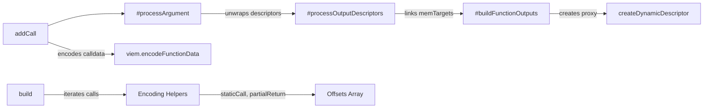

<!-- agentify: generated 2026-05-31 | score-before: 0 | source: 1.3.0 -->
# JavaScript Library

The offchain transaction builder. The `TransactionBuilder` class simulates the
EVM memory layout as calls are added, tracks data dependencies between calls
through descriptor proxies, and produces the four parallel arrays
(`targets`, `offsets`, `calldatas`, `msgValues`) that `MulticallScripter.execute()`
expects.

## Key Files

| File | Lines | Purpose |
|------|-------|---------|
| `js/index.js` | 697 | TransactionBuilder class, encoding helpers, type utilities |
| `js/cli.js` | 72 | CLI wrapper (`tx-builder` binary) for building transactions from JSON |
| `js/abi.js` | — | ABI file loader |
| `js/examples/` | — | Runnable strategy scripts (Uniswap, Aave, ERC20) |
| `js/test/` | — | Bun test suite (one file per feature) |

## Internal Architecture



## Important Patterns

### Descriptor proxy system
`addCall()` returns a proxy object, not a value. The proxy carries metadata:
- `callIndex` — which call produced this value
- `offset` — byte position in the return data
- `size` — byte width (32 for uint256, variable for dynamic types)
- `type` — Solidity ABI type string

When a descriptor is passed as an argument to a later `addCall()`, `#processArgument` replaces it with a placeholder value, and `#processOutputDescriptors` links the source call's return data position to the target call's calldata position.

### Virtual memory layout
The builder maintains a `free_mem` pointer tracking cumulative calldata size. Each call reserves space for its calldata. When a descriptor is used, the builder calculates the exact byte position in the concatenated calldata region where return data should be copied. This mirrors what `MulticallScripter.execute()` does on-chain.

### Offset encoding (must match Solidity exactly)

```javascript
// Regular static call: [8:0xFF][120:memTarget][120:resultLength]
staticCall(0x24n, 0x20n)
// → 0xFF << 248 | 0x24 << 120 | 0x20

// Partial return: 3 variables packed into 120+48+48 bits
staticCallPartialReturn(
  [memTarget0, memTarget1, memTarget2],  // max 40 bits each
  [len0, len1, len2],                     // max 16 bits each
  [off0, off1, off2],                     // max 16 bits each
  totalReturnDataSize                     // max 16 bits
)
```

### Dynamic type handling
Types like `bytes`, `string`, and `address[]` require `.with_length(n)` because the builder needs to know the output size to calculate memory positions for subsequent calls. Without it, `addCall` throws: `"Dynamic return type 'X' requires .with_length(n) before use"`.

### Struct and array element access
```javascript
// Struct field access via dot notation
const user = builder.addCall(aaveABI, pool, "getUserAccountData", [userAddr]);
builder.addCall(aaveABI, pool, "borrow", [dai, user.availableBorrowsBase, 2, 0, userAddr]);

// Array element access via index
const owners = builder.addCall(abi, target, "getOwners", []);
owners.with_length(3);
builder.addCall(abi, target, "transfer", [owners[0], amount]);
```

## Gotchas

- **Single-use descriptors**: `usedDescriptors` Set prevents reusing the same output. The builder throws if a descriptor is passed to a second `addCall()`.
- **State-changing call return chaining**: The current implementation only chains return values from static calls. State-changing calls with return data support is available via `CALL_PARTIAL_RETURN_FLAG (0xFB)` but is limited.
- **Max 3 variables**: `PARTIAL_RETURN_VARS = 3`. A call that produces more than 3 usable output slots is not supported.
- **Dynamic type ordering**: At most one dynamic return type per function, and it must be the last return value in the ABI outputs.
- **Default values in placeholders**: When a descriptor is used as a placeholder argument, a zero/empty default value is used in the encoded calldata. The actual return data overwrites this at execution time.

## See Also

- Solidity execution engine → [docs/contracts.md](contracts.md)
- Example usage scripts → [docs/examples.md](examples.md)
- JavaScript coding conventions → [.claude/rules/javascript.md](../.claude/rules/javascript.md)
- Architecture overview → [docs/OVERVIEW.md](OVERVIEW.md)
