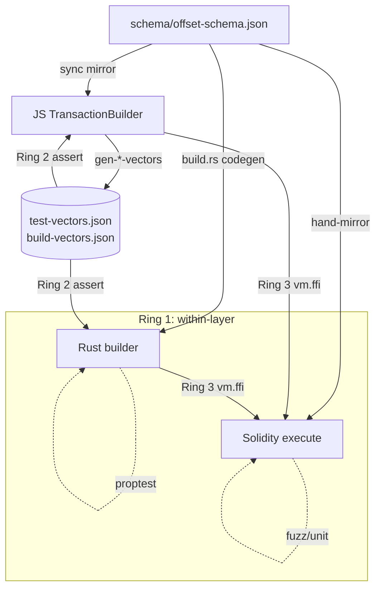

<!-- agentify: generated 2026-05-31 | score-before: 0 | source: 1.3.0 -->
# Testing

Three-layer test suite validating the Solidity contracts, the JavaScript builder, and the Rust
builder, plus cross-layer parity tests that verify all three produce identical output and that the
output executes correctly on-chain. All three layers derive from one canonical bit layout
(`schema/offset-schema.json`), so the tests below exist mainly to prove they stay in agreement.

## Key Files

| File | Purpose |
|------|---------|
| `test/MulticallScripter.t.sol` | Core contract tests: static/state-changing calls, value transfer, partial returns, fuzz, edge cases |
| `test/CallBuilder.t.sol` | Solidity DSL tests: chaining patterns, error cases, offset decoding |
| `test/JsLibrary.t.sol` | Cross-layer FFI: runs JS builder via `vm.ffi`, compares offsets, executes transactions on-chain |
| `test/RustLibrary.t.sol` | Cross-layer FFI: runs the **Rust** CLI via `vm.ffi`, executes its output through the real contract |
| `test/7702Caller.t.sol` | EIP-7702 account abstraction tests |
| `test/GasComparisons.t.sol` / `GasBenchmarks.t.sol` | Gas comparison vs Weiroll; interpreter-overhead decomposition |
| `test/Helpers.sol` | Mock contracts used across tests: SimpleReturn, DynamicReturn, Structs, etc. |
| `js/test/` | Bun suite: one file per feature, plus `goldenVectors`, `buildVectors`, `schemaSync`, `schemaRoundtrip` |
| `rust/crates/codec/tests/{golden,properties}.rs` | Rust codec: golden-vector parity vs JS + proptest roundtrips |
| `rust/crates/builder/tests/{builder,parity}.rs` | Rust builder: error paths + whole-transaction parity vs JS |
| `schema/offset-schema.json` | Canonical bit layout — the thing every layer must agree with |
| `js/test-vectors.json`, `js/build-vectors.json` | Committed JS-generated golden vectors asserted by both JS and Rust |

## Cross-layer verification & parity

No single test proves correctness; three rings chain together so a bug has nowhere to hide. The
foundation is that all layers derive constants from **`schema/offset-schema.json`** — Solidity
mirrors it by hand, JS reads a generated mirror (`js/offset-schema.json`, kept in sync by
`bun run sync:schema` and guarded by `js/test/schemaSync.test.js`), and Rust codegens from it
(`rust/crates/codec/build.rs`).

**Ring 1 — within a single layer.** Rust codec proptests (`tests/properties.rs`) prove encode→decode
roundtrips and bounds rejection for random inputs; Solidity fuzz/unit tests prove `execute()`
decodes and splices correctly. This catches internal inconsistencies but not cross-layer disagreement.

**Ring 2 — cross-language golden vectors.** The JS layer (the reference) generates expected outputs,
commits them, and the other layers assert against the committed file:
- **offset-level** — `js/scripts/gen-test-vectors.js` → `js/test-vectors.json`, asserted by
  `js/test/goldenVectors.test.js` (JS drift) and `rust/crates/codec/tests/golden.rs` (Rust ≡ JS).
- **whole-transaction** — `js/scripts/gen-build-vectors.js` → `js/build-vectors.json` records full
  `build()` output (offsets + calldatas + msgValues) for 6 scenarios, asserted by
  `js/test/buildVectors.test.js` and `rust/crates/builder/tests/parity.rs`. Comparing *calldata*
  (viem vs alloy) — not just offsets — is what caught the Rust dynamic-placeholder bug.

**Ring 3 — on-chain reality.** Agreement isn't correctness, so built transactions are executed
through the real contract via Foundry FFI: `JsLibrary.t.sol` (JS builder) and `RustLibrary.t.sol`
(Rust CLI) call `multicall.execute(...)` and assert on-chain state.

**Transitive proof.** Some paths can't be tested everywhere — dynamic-return chaining is a
library-level feature the CLI's `{callIndex,offset,size}` ref contract can't express (true for
`cli.js` too). The parity harness proves *Rust dynamic ≡ JS dynamic* byte-for-byte, and the JS
dynamic path is anchored on-chain (`js/test/stringOperations.js` + `JsLibrary`) — so Rust is correct
transitively.

**Maintenance flow.** Edit `schema/offset-schema.json` → `bun run sync:schema` →
`bun js/scripts/gen-test-vectors.js` + `gen-build-vectors.js` → `cargo test` (golden/parity fail if
Rust ≠ JS) → `bun test` (golden/build/schema-sync fail if JS drifted) → `forge test`
(JsLibrary/RustLibrary fail if on-chain breaks).



## Important Patterns

### Test isolation
Foundry tests use `setUp()` to deploy fresh contract instances before each test. Contract-level arrays (`targets[]`, `offsets[]`, `calldatas[]`, `values[]`) are storage variables implicitly cleared by Foundry's test isolation — no explicit cleanup needed.

### Cross-layer integration (JsLibrary.t.sol)
The most critical test pattern: Solidity tests call JavaScript test scripts via `vm.ffi()`, then compare the JS-built arrays against Solidity-built arrays:

```solidity
string[] memory inputs = new string[](4);
inputs[0] = "bun";
inputs[1] = "js/test/simpleValue.js";
inputs[2] = vm.toString(address(simpleReturn));
inputs[3] = "out/Helpers.sol/SimpleReturn.json";
bytes memory res = vm.ffi(inputs);
// Parse JSON → arrays → compare with Solidity-built arrays → execute
```

If both layers produce identical offsets, the system is consistent.

### Encoding roundtrip tests
`test_js_encoding_roundtrip()` in `JsLibrary.t.sol` specifically validates that JS-encoded offsets decode correctly via the `CallDecoder`:
```solidity
uint256 staticCallSimple = vm.parseJsonUint(json, ".staticCallSimple");
assertEq(callDecoder.getMemTarget(staticCallSimple), 0x24);
assertEq(callDecoder.getResultLength(staticCallSimple), 0x20);
```

### Fuzz testing
Foundry fuzz tests use function parameters as fuzz inputs:
```solidity
function test_fuzz_simple_set_and_get(uint256 set) public { ... }
function test_fuzz_bytes(bytes calldata startData) public { ... }
```
The calldata fuzz tests are particularly important — the execution pipeline must handle arbitrarily sized calldata correctly.

### JavaScript test structure
Each JS test file exports a function that returns JSON via `stdout`. The Solidity layer parses this JSON. Tests follow the pattern:
```javascript
const result = builder.build();
const output = {
  targets: [...],
  offsets: result.offsets.map(o => o.toString()),
  calldatas: [...],
  msgValues: result.msgValues.map(v => v.toString()),
};
process.stdout.write(JSON.stringify(output));
```

## Gotchas

- **FFI requires `ffi = true`** in `foundry.toml` — tests silently skip without it
- **ABI paths use `out/Helpers.sol/ContractName.json`** — must run `forge build` before tests that depend on FFI
- **Empty `values` array for zero-value calls**: The builder returns an empty array when all calls have `msgValue=0`. Solidity tests use `stateChangingCall(0x0)` to avoid pushing to values.
- **Not all test files run the actual execution**: Some `JsLibrary.t.sol` tests only validate the encoding (e.g., `test_js_encoding_roundtrip`) — look for `multicall.execute(...)` to see which tests actually submit transactions.

## See Also

- Solidity contract patterns → [docs/contracts.md](contracts.md)
- JavaScript builder patterns → [docs/javascript.md](javascript.md)
- Rust library & parity model → [docs/rust.md](rust.md)
- Testing conventions → [.claude/rules/testing.md](../.claude/rules/testing.md)
- Architecture overview → [docs/OVERVIEW.md](OVERVIEW.md)
