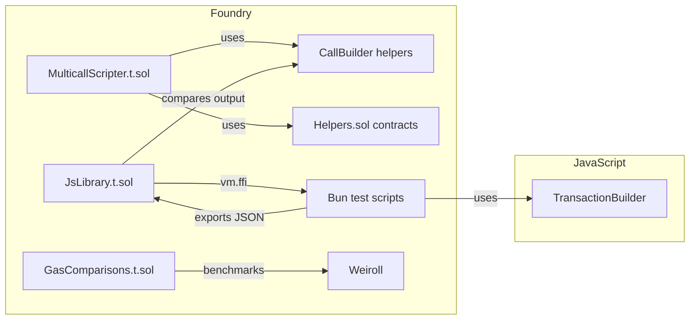

<!-- agentify: generated 2026-05-31 | score-before: 0 | source: 1.3.0 -->
# Testing

Dual-layer test suite that validates both the Solidity contracts and the
JavaScript builder, plus cross-layer integration tests that verify the two
layers produce identical output.

## Key Files

| File | Lines | Purpose |
|------|-------|---------|
| `test/MulticallScripter.t.sol` | 434 | Core contract tests: static calls, state-changing calls, value transfer, partial returns, fuzz tests, edge cases |
| `test/CallBuilder.t.sol` | — | DSL functionality tests: chaining patterns, error cases, offset decoding |
| `test/JsLibrary.t.sol` | 468 | Cross-layer integration: calls JS tests via FFI, compares offsets, executes transactions |
| `test/7702Caller.t.sol` | — | EIP-7702 account abstraction tests |
| `test/GasComparisons.t.sol` | 101 | Gas comparison against Weiroll for equivalent operations |
| `test/Helpers.sol` | — | Mock contracts used across tests: SimpleReturn, DynamicReturn, Structs, Fuzzy, etc. |
| `js/test/` | 13 files | Bun test suite: one file per feature (simpleValue, complexStructs, dynamicArray, etc.) |

## Test Architecture



## Important Patterns

### Test isolation
Foundry tests use `setUp()` to deploy fresh contract instances before each test. Contract-level arrays (`targets[]`, `offsets[]`, `calldatas[]`, `values[]`) are storage variables implicitly cleared by Foundry's test isolation — no explicit cleanup needed.

### Cross-layer integration (JsLibrary.t.sol)
The most critical test pattern: Solidity tests call JavaScript test scripts via `vm.ffi()`, then compare the JS-built arrays against Solidity-built arrays:

```solidity
string[] memory inputs = new string[](4);
inputs[0] = "bun";
inputs[1] = "js/test/simpleValue.js";
inputs[2] = vm.toString(address(simpleReturn));
inputs[3] = "out/Helpers.sol/SimpleReturn.json";
bytes memory res = vm.ffi(inputs);
// Parse JSON → arrays → compare with Solidity-built arrays → execute
```

If both layers produce identical offsets, the system is consistent.

### Encoding roundtrip tests
`test_js_encoding_roundtrip()` in `JsLibrary.t.sol` specifically validates that JS-encoded offsets decode correctly via the `CallDecoder`:
```solidity
uint256 staticCallSimple = vm.parseJsonUint(json, ".staticCallSimple");
assertEq(callDecoder.getMemTarget(staticCallSimple), 0x24);
assertEq(callDecoder.getResultLength(staticCallSimple), 0x20);
```

### Fuzz testing
Foundry fuzz tests use function parameters as fuzz inputs:
```solidity
function test_fuzz_simple_set_and_get(uint256 set) public { ... }
function test_fuzz_bytes(bytes calldata startData) public { ... }
```
The calldata fuzz tests are particularly important — the execution pipeline must handle arbitrarily sized calldata correctly.

### JavaScript test structure
Each JS test file exports a function that returns JSON via `stdout`. The Solidity layer parses this JSON. Tests follow the pattern:
```javascript
const result = builder.build();
const output = {
  targets: [...],
  offsets: result.offsets.map(o => o.toString()),
  calldatas: [...],
  msgValues: result.msgValues.map(v => v.toString()),
};
process.stdout.write(JSON.stringify(output));
```

## Gotchas

- **FFI requires `ffi = true`** in `foundry.toml` — tests silently skip without it
- **ABI paths use `out/Helpers.sol/ContractName.json`** — must run `forge build` before tests that depend on FFI
- **Empty `values` array for zero-value calls**: The builder returns an empty array when all calls have `msgValue=0`. Solidity tests use `stateChangingCall(0x0)` to avoid pushing to values.
- **Not all test files run the actual execution**: Some `JsLibrary.t.sol` tests only validate the encoding (e.g., `test_js_encoding_roundtrip`) — look for `multicall.execute(...)` to see which tests actually submit transactions.

## See Also

- Solidity contract patterns → [docs/contracts.md](contracts.md)
- JavaScript builder patterns → [docs/javascript.md](javascript.md)
- Testing conventions → [.claude/rules/testing.md](../.claude/rules/testing.md)
- Architecture overview → [docs/OVERVIEW.md](OVERVIEW.md)
